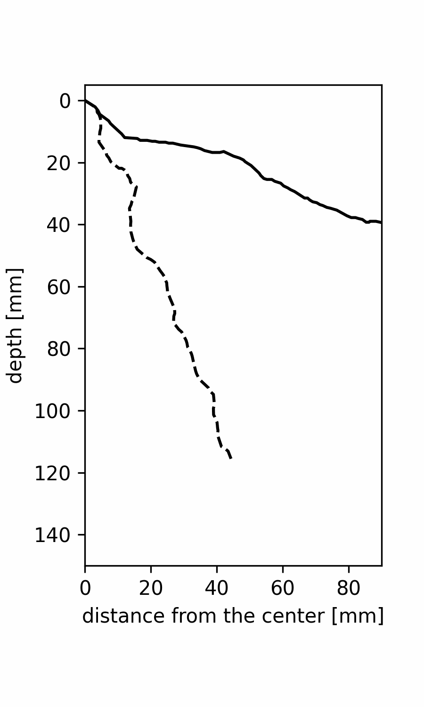

# RSAtrace4D: A semi-automatic workflow  for 4D measurement of root system architecture from time-series X-ray CT data using backward prediction


## introduction

Root system architecture (RSA) is one of the most important traits for plants. Nondestructive measurement of RSA in the soil can be used to assess temporal growth of RSA. RSA in the soil is imaged by X-ray computed tomography (CT). However, there was limited method to efficiently quantify RSA from time series of X-ray CT images. We hypothesized that this problem could be solved by taking advantage of the fact that roots in the soil do not move once they have grown. We also hypothesized that RSA growth can be calculated by overlaying two RSA images at different time points. We developed RSAtrace4D. Referring to RSA vector, which represents RSA structure, at the last time point of time series data, RSAtrace4D predicts RSA vectors at all time point by barckward prediction. If only the vector data for the last day is created manually, the remaining vector data can be predicted fully automatically. 

## system requirements

RSAtrace4D is confirmed to work with Python 3.8.12 on Ubuntu 20.04 with RTX3090 GPU. The software uses tensorflow. Please prepare your environment so that you can use tensorflow. I recommend creating a virtual environment for python 3.8.12 with `virtualenv`.

## installation

Run the following commands:

```
git clone https://github.com/st707311g/RSAtrace4D/
```

The following command will install the required packages.

```
pip install -U pip
pip install -r RSAtrace4D/requirements.txt
```

Install [SBI-ICP_registration](https://github.com/st707311g/SBI-ICP_registration/) for 3D alignments of time-series X-ray CT data and [RSAvis3D](https://github.com/st707311g/RSAvis3D/) to verify the results of the demonstration.

```
git clone https://github.com/st707311g/SBI-ICP_registration.git
pip install -r SBI-ICP_registration/requirements.txt
git clone https://github.com/st707311g/RSAvis3D.git
pip install -r RSAvis3D/requirements.txt
```

These software can reduce processing time by using `CuPy`. Installation depends on the version of `CUDA Toolkit`. Please build the environment according to your own version of `CUDA Toolkit`. For example, if the version of `CUDA Toolkit` is 11.3, install cupy with the following command.

```
pip install cupy-cuda113
```

Please check if CuPy is available by using the following command.
```
python SBI-ICP_registration/is_cupy_available.py
```

## demonstration

### 1. data preparing

Download the demo data (1.60G), which is a time-series X-ray CT data of an upland rice cultivar from 7 to 27 days after sowing ([Teramoto et al. 2020 Plant Methods](https://plantmethods.biomedcentral.com/articles/10.1186/s13007-020-00612-6)). The intensity of this data is normalized in the way described in [RSAvis3D github repository](https://github.com/st707311g/RSAvis3D); CT slice images were converted into 8 bit jpeg files, signal intensity of the air is around 0 and signal intensity of the soil is around 128.

```
wget https://rootomics.dna.affrc.go.jp/data/rice_root_daily_growth_intensity_normalized.zip
unzip rice_root_daily_growth_intensity_normalized.zip
rm rice_root_daily_growth_intensity_normalized.zip
```

There are 21 directories in rice_root_daily_growth_intensity_normalized.

```
ls rice_root_daily_growth_intensity_normalized
> DAS07  DAS09  DAS11  DAS13  DAS15  DAS17  DAS19  DAS21  DAS23  DAS25  DAS27
> DAS08  DAS10  DAS12  DAS14  DAS16  DAS18  DAS20  DAS22  DAS24  DAS26
```

**Note: directory names must contain numbers representing days after sowing. In addition, name them in such a way that when sorted, they are ordered from the smallest days after sowing to the largest.**

### 2. volume alignment

Perform `SBI-ICP registration` for volume alignments of time-series X-ray CT data. `SBI-ICP registration` detects segments with a signal intensity of 255 as a point cloud and aligns the time-series volumes by performing ICP registration with the point clouds. 

```
python SBI-ICP_registration -s rice_root_daily_growth_intensity_normalized
```

The registrated files are stored in the `.registrated` directory in `rice_root_daily_growth_intensity_normalized`.

To check the results, extract the RSA image using RSAvis3D. RSAvis3D automatically references the `.registered` directory.

```
python RSAvis3D -s rice_root_daily_growth_intensity_normalized
```

Processed files are saved in the `.segmentated` directory in `rice_root_daily_growth_intensity_normalized`.

### 3. making RSA vector at the last time point

Mkae RSA vector of `rice_root_daily_growth_intensity_normalized/.segmentated/DAS27` with a RSA vectorization software [RSAtrace3D](https://github.com/st707311g/RSAtrace3D/). To save time and ensure reproducibility, this demonstration will use RSA vectors prepared in advance.

Download the RSA vector data at 27 days after sowing and copy it to the `.segmentated` directory. 

```
wget https://rootomics.dna.affrc.go.jp/data/rice_root_daily_growth_intensity_normalized_DAS27_vector.zip
unzip rice_root_daily_growth_intensity_normalized_DAS27_vector.zip
rm rice_root_daily_growth_intensity_normalized_DAS27_vector.zip
mv DAS27.rinfo rice_root_daily_growth_intensity_normalized/.segmentated/
```

**Note: this vector data is slightly different from that used in the paper.**

### 4. performing backward prediction

Run RSAtrace4D. RSAtrace4D automatically seeks the subdirectories.

```
python RSAtrace4D/ -s rice_root_daily_growth_intensity_normalized/
```

The results are stored in `rice_root_daily_growth_intensity_normalized/.segmentated/` dicrectory. 

- **.RSAtrace4D_raw_result.csv** - raw data of result
- **.RSAtrace4D_RSA_params.csv** - RSA growth parameters calculated by ".RSAtrace4D_raw_result.csv"
- **.RSAtrace4D_raw_result_raw.png** - graphical result of ".RSAtrace4D_raw_result.csv", raw data plotted
- **.RSAtrace4D_raw_result_fitted.png** - graphical result of ".RSAtrace4D_raw_result.csv", fitted data plotted
- **.models_for_BP/** - trained models for each root and intermediate data generated by RSAtrace4D

### 5. making RSA vectors at all time points

Referring to the RSAtrace4D results, you can make time-series RSA vectors by the following command.

```
python RSAtrace4D/make_vectors.py -s rice_root_daily_growth_intensity_normalized/
```

The resulting RSA vectores are stored in `.segmentated/.predicted_RSA_vectors` directory. 



Figure: Animation of RSA development generated usign 21 RSA vectors. Dash line: seminal root, solid lines: nodal roots.

## performance

The confirmed operating environments are shown below:

Environment 1:
- CPU: Xeon 18-Core W-2295 3.0GHz
- GPU: NVIDIA GeForce RTX3090
- CUDA Toolkit (11.3)
- Memory: 96 GB
- Ubuntu 20.04.3 LTS
- Python (3.8.12)
    - coloredlogs (15.0.1)
    - cupy-cuda113 (10.5.0)
    - keras (2.9.0)
    - numpy (1.22.4)
    - open3d (0.15.2)
    - opencv-python (4.5.5.64)
    - pandas (1.4.2)
    - scikit-image (0.19.2)
    - scipy (1.8.1)
    - tensorflow (2.9.1)
    - tqdm (4.64.0)

Under these conditions, backward prediction takes only a few minutes.

## version policy

Version information consists of major and minor versions (major.minor). When the major version increases by one, it is no longer compatible with the original version. When the minor version invreases by one, compatibility will be maintained. Revisions that do not affect functionality, such as bug fixes and design changes, will not affect the version number.

## citation

Papers being submitted for publication.

## license

NARO NON-COMMERCIAL LICENSE AGREEMENT Version 1.0

This license is for 'Non-Commercial' use of software for RSAtrace4D

* Scientific use of RSAtrace4D is permitted free of charge.
* Modification of RSAtrace4D is only permitted to the person of downloaded and his/her colleagues.
* The National Agriculture and Food Research Organization (hereinafter referred to as NARO) does not guarantee that defects, errors or malfunction will not occur with respect to RSAtrace4D.
* NARO shall not be responsible or liable for any damage or loss caused or be alleged to be caused, directly or indirectly, by the download and use of RSAtrace4D.
* NARO shall not be obligated to correct or repair the program regardless of the extent, even if there are any defects of malfunctions in RSAtrace4D.
* The copyright and all other rights of RSAtrace4D belong to NARO.
* Selling, renting, re-use of license, or use for business purposes etc. of RSAtrace4D shall not be allowed. For commercial use, license of commercial use is required. Inquiries for such commercial license are directed to NARO.
* The RSAtrace4D may be changed, or the distribution maybe canceled without advance notification.
*In case the result obtained using RSAtrace4D in used for publication in academic journals etc., please refer the publication of RSAtrace4D and/or acknowledge the use of RSAtrace4D in the publication.

Copyright (C) 2022 National Agriculture and Food Research Organization. All rights reserved.

## project homepage
https://rootomics.dna.affrc.go.jp/en/

## update history

* version 1.0 (June 2, 2022)
  * initial version uploaded